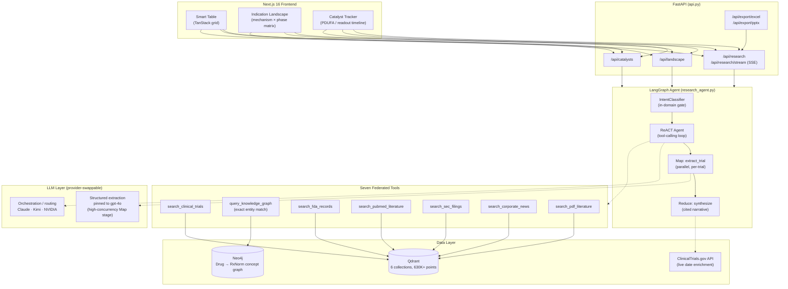

<div align="center">

# OpenBio-Intel

**The open-source AI intelligence platform for clinical trials, regulatory approvals, and biopharma landscape analysis.**

[](LICENSE)
[](pyproject.toml)
[](frontend/package.json)
[](pyproject.toml)
[](pyproject.toml)
[](https://qdrant.tech)
[](https://neo4j.com)

[Quickstart](#5-minute-quickstart) · [Architecture](#architecture) · [Capabilities](#key-capabilities) · [Contributing](CONTRIBUTING.md)

</div>

---

Ask a question like *"Compare the mechanisms and sponsors of Phase 3 oncology trials"* and get back a cited, structured answer grounded in real clinical trial registries, FDA approval records, peer-reviewed literature, SEC filings, and live corporate disclosures — not a language model's memory. Every claim traces to a real source record; nothing is answered from the model's own parametric knowledge.

## Why this matters

Commercial biopharma intelligence platforms (Cortellis, AlphaSense, and similar tools like Maven Bio) solve a real problem — but as closed, subscription-gated SaaS products, they're opaque about methodology, expensive to access, and impossible to self-host, extend, or audit.

| | OpenBio-Intel | Typical commercial platforms |
|---|---|---|
| **License** | Open source (MIT) | Proprietary |
| **Self-hostable** | Yes — Docker Compose or your own cloud | No — SaaS only |
| **Pricing** | Free to run yourself | Enterprise subscription |
| **Source transparency** | Every claim cites a real record (NCT ID, PMCID, accession number) you can open | Black-box synthesis |
| **Extensibility** | Fork it, add a data source, change the model | Closed platform |
| **Data sources** | ClinicalTrials.gov, openFDA, PubMed Central, SEC EDGAR, corporate press/earnings, a RxNorm-linked knowledge graph | Varies, undisclosed methodology |
| **Deployment** | Your infrastructure, your data residency | Vendor's cloud |

This isn't a claim that we've matched every feature of an enterprise product with a decade of development behind it — it's an invitation to build that in the open, with a codebase you can actually read.

## Architecture

A LangGraph ReACT agent federates retrieval across six independent Qdrant collections and a Neo4j knowledge graph, then synthesizes cited, structured answers. Three purpose-built pipelines (Smart Table, Indication Landscape, Catalyst Tracker) share the same retrieval layer but use different synthesis strategies suited to each question shape.



**Why a knowledge graph *and* a vector store?** Vector search finds semantically similar text — great for "what does the literature say about X," bad for "does this specific drug exist under any of its trade names." `query_knowledge_graph` resolves a drug name (brand or generic) against a Neo4j graph built from RxNorm concept mappings via exact Cypher traversal — deterministic, not a similarity guess. Querying "Keytruda" correctly matches every trial that used "pembrolizumab," "MK-3475," or any other name the same RxNorm concept resolves to, with zero fuzzy-match hallucination risk. An empty result is a genuine "not in the graph" signal, not a low-confidence guess.

**Why federate across six collections instead of one?** Different questions need different evidence. "What's Merck's stated pipeline strategy?" needs SEC filings, not trial registries. "What's the reported ORR for this combination?" needs conference-poster efficacy tables, not a registry's design summary. Each tool is scoped to what its corpus can actually answer, and the agent decides which to call — not a single undifferentiated blob of "everything."

## Key capabilities

- **Federated retrieval RAG** across ClinicalTrials.gov, openFDA drug approvals, PubMed Central full-text, SEC EDGAR 10-K/8-K filings, corporate press releases + earnings call transcripts, and parsed conference-poster PDFs — seven tools, six Qdrant collections, one agent deciding which apply to a given question.
- **RxNorm-linked knowledge graph** (Neo4j + scispacy entity resolution) for deterministic drug entity matching — brand name, generic name, and every RxNorm-mapped synonym resolve to the same concept via exact graph traversal, not vector similarity.
- **Interactive Indication Landscape matrices** — a competitive grid of mechanism/target rows against development-phase columns for any therapeutic area, grounded strictly in retrieved trials, FDA records, and literature.
- **Clinical Catalyst & Readout Tracker** — a chronological timeline of upcoming market-moving events (Phase 3 primary completions, PDUFA dates), backed by live ClinicalTrials.gov date lookups and SEC-disclosed regulatory timelines.
- **Strict corpus grounding** — the synthesis prompt and schema forbid supplying a drug mechanism from the model's own knowledge. If a source record doesn't describe how a drug works, the row says so rather than filling the gap with a plausible-sounding fabrication.
- **Automated executive exports** — one-click `.pptx` and `.xlsx` generation from whatever the analyst is already looking at, no re-running the agent.
- **Provider-swappable LLM layer** — orchestration/routing runs on Anthropic, Kimi (Moonshot), or NVIDIA-hosted models via one `LLM_PROVIDER` switch; high-concurrency structured extraction is pinned to OpenAI gpt-4o regardless, since that Map-stage shape (dozens of parallel calls per query) needs a provider tier that can actually sustain it.

## 5-minute quickstart

Requires [Docker](https://docs.docker.com/get-docker/) and Docker Compose, plus an [OpenAI API key](https://platform.openai.com/api-keys) (embeddings — required) and an [Anthropic API key](https://console.anthropic.com/) (agent orchestration — required unless you switch `LLM_PROVIDER`).

```bash
git clone https://github.com/JAGAN666/OpenBio-Intel.git
cd OpenBio-Intel
./quickstart.sh
```

`quickstart.sh` will:
1. Check for Docker and Docker Compose.
2. Copy `.env.example` to `.env` if it doesn't exist yet (**you'll need to add your API keys before continuing** — the script pauses here).
3. Build and start Qdrant, Neo4j, the FastAPI backend, and the Next.js frontend.
4. Run a lightweight seed (50 clinical trials + 50 FDA approval records) so the UI is immediately interactive.

Once it finishes, open **http://localhost:3000** and try one of the example queries. The first Docker build compiles a knowledge-graph image with scispacy baked in and takes a few extra minutes — subsequent runs reuse the cached layers.

This lightweight seed is enough to explore the UI and prove the pipeline end-to-end, not a research-grade corpus. See [`seed_bulk_data.py`](seed_bulk_data.py) to ingest the full ClinicalTrials.gov + openFDA corpora (hundreds of thousands of records — expect this to run for hours and to incur real embedding API cost).

## Environment configuration

Every variable is documented inline in [`.env.example`](.env.example) — copy it to `.env` and fill in what you need. Summary:

| Variable | Required? | Purpose |
|---|---|---|
| `OPENAI_API_KEY` | **Required** | Embeddings (`text-embedding-3-small`) for every retrieval path, and the pinned gpt-4o structured-extraction stage. |
| `ANTHROPIC_API_KEY` | Required (default provider) | Agent orchestration/routing on Claude. Not needed if `LLM_PROVIDER` is set to `kimi` or `nvidia` instead. |
| `LLM_PROVIDER` | Optional | `anthropic` (default), `kimi`, or `nvidia` — which provider handles orchestration/routing calls. |
| `KIMI_API_KEY` | Optional | Only if `LLM_PROVIDER=kimi`. |
| `NVIDIA_API_KEY` | Optional | Only if `LLM_PROVIDER=nvidia`, or for `evaluate_agent.py`'s judge model. |
| `NEO4J_URI` / `NEO4J_USER` / `NEO4J_PASSWORD` | Optional | Knowledge-graph entity resolution. Defaults match Docker Compose's `neo4j` service. |
| `LLAMA_CLOUD_API_KEY` | Optional | Only for PDF ingestion (`parse_pdfs.py`). |
| `NCBI_API_KEY` / `NCBI_ENTREZ_EMAIL` | Optional | Only for PubMed ingestion (`fetch_pubmed.py`). |
| `SEC_EDGAR_COMPANY` / `SEC_EDGAR_EMAIL` | Optional | Only for SEC filing ingestion (`fetch_sec_edgar.py`) — required by SEC EDGAR's own fair-access policy, not this project. |
| `S3_BUCKET` / `AWS_DEFAULT_REGION` | Optional | Only if archiving raw ingestion payloads to S3 (`--skip-s3` avoids this entirely for local use). |

## Running the stack manually (without `quickstart.sh`)

```bash
# 1. Qdrant + Neo4j
docker compose up -d qdrant neo4j

# 2. Python environment
uv sync --locked          # creates .venv from the committed uv.lock (install uv: https://docs.astral.sh/uv/)

# 3. Backend  (http://127.0.0.1:8000 — /docs for OpenAPI, /api/health for readiness)
.venv/bin/python -m uvicorn api:app --reload --port 8000

# 4. Frontend  (http://localhost:3000)
cd frontend && npm install && npm run dev
```

## Repository layout

| Path | Purpose |
|---|---|
| `research_agent.py` | The LangGraph agent — tool definitions, retrieval, extraction, synthesis, three graph builders (Smart Table / Landscape / Catalyst). |
| `api.py` | FastAPI surface — REST + SSE streaming endpoints, executive export generation. |
| `embeddings.py` | Shared OpenAI embedding client (`text-embedding-3-small`). |
| `build_kg.py` / `build_kg_pubmed.py` | Knowledge-graph construction — scispacy NER + RxNorm entity linking into Neo4j. |
| `fetch_and_embed_trials.py`, `seed_bulk_data.py`, `fetch_daily_updates.py` | ClinicalTrials.gov + openFDA ingestion (bulk seed and daily delta). |
| `fetch_pubmed.py`, `fetch_sec_edgar.py`, `fetch_news_and_transcripts.py` | PubMed, SEC EDGAR, and corporate news/earnings ingestion. |
| `parse_pdfs.py`, `ingest_pipeline.py` | Conference-poster / FDA-filing PDF ingestion via vision-based table extraction. |
| `evaluate_agent.py`, `analyze_trace.py` | Ragas-based faithfulness/relevancy evaluation against an independent judge model. |
| `frontend/` | Next.js 16 App Router UI — Smart Table, Indication Landscape, Catalyst Tracker. |
| `terraform/` | Reference AWS deployment (ECS Fargate, ALB, EFS, GitHub Actions OIDC deploy pipeline) — optional, not required to run locally. |

## Contributing

Contributions are welcome — see [CONTRIBUTING.md](CONTRIBUTING.md) for development setup, testing expectations, and PR guidelines. Bug reports and feature requests: use the [issue templates](.github/ISSUE_TEMPLATE/).

## Contributors

- **JAGAN666** ([@JAGAN666](https://github.com/JAGAN666)) — creator & maintainer

Want to see your name here? Open a PR — see [CONTRIBUTING.md](CONTRIBUTING.md).

## License

[MIT](LICENSE) — use it, fork it, deploy it, build on it.
