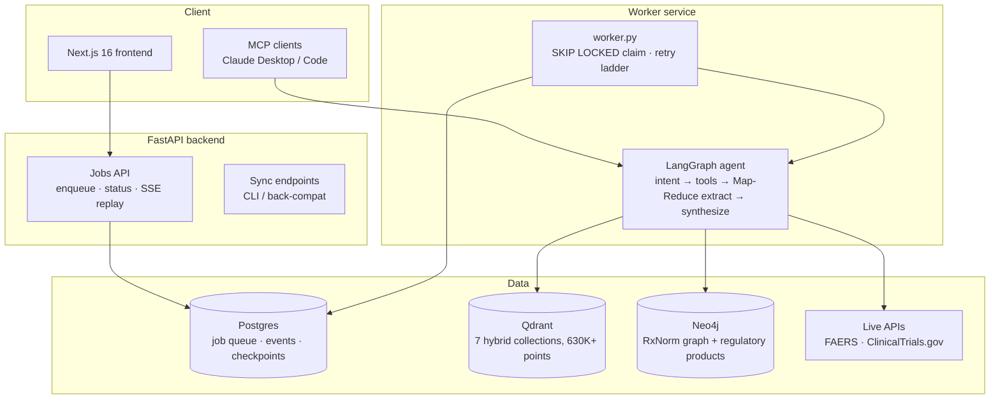

# Architecture

## The retrieval stack

1. **Hybrid search** — every query hits Qdrant with two prefetch branches (OpenAI `text-embedding-3-small` dense + `Qdrant/bm25` sparse) fused server-side with reciprocal rank fusion. Biopharma queries are full of exact tokens dense embeddings blur — NCT ids, development codes like `BBO-10203` — which is precisely where BM25 wins. Measured effect on our golden set: mean recall@20 **0.44 → 0.59**.
2. **Cross-encoder reranking** — 100 fused candidates re-scored by a MiniLM cross-encoder, top-k survive. Recall@20 **0.59 → 0.61**, and the expensive extraction stage sees better rows.
3. **Knowledge-graph resolution** — Neo4j `(Trial)-[:INVESTIGATES]->(Drug)-[:MAPPED_TO_RXNORM]->(Concept)` traversal resolves brand/generic/synonym to one concept deterministically, with automatic vector fallback when a development-code drug has no RxNorm mapping.

## The extraction stack

The Smart Table fans out one LangGraph `Send` worker per retrieved trial (up to ~114 in the demo GIF). Each worker:

- receives the **shared evidence pools first, its trial record last** — so the whole fan-out shares one long identical prompt prefix that OpenAI's prompt cache serves at half price (verified: 2K+ cached tokens per worker);
- runs a **model cascade**: gpt-4o-mini first with a deterministic accept gate (schema parse + the NCT id must match the worker's own record), escalating to gpt-4o only on rejection;
- emits **per-row citations** — the registry link is attached deterministically from the worker's NCT id; auxiliary citations (PMCID, filing URL) only when the model actually fused that evidence.

## Durability

Every query is a **job**: `POST /api/jobs` returns in milliseconds, a separate worker service executes, progress events land in Postgres, and the SSE stream replays the full log on every (re)connect — a refreshed tab reattaches losing nothing. The research graph checkpoints to Postgres after every super-step, so a worker killed mid-run **resumes instead of restarting** (measured: 33s resume vs ~150s fresh on the same query).

## Grounding

Retrieval tools carry per-corpus lexical grounding gates — kNN always returns *something*, so "did anything retrieved share real vocabulary with the question" is checked before results count. The synthesis schema forbids mechanisms from model memory: an honest gap beats a plausible fabrication.
