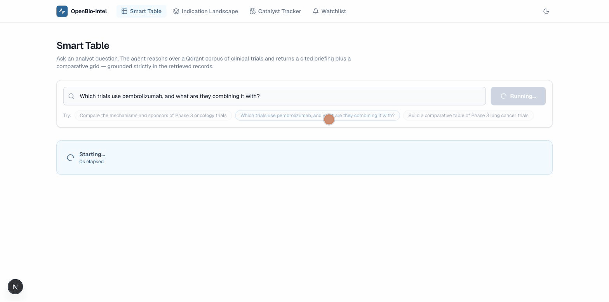

# OpenBio-Intel

**Open-source clinical market intelligence for biopharma — the AlphaSense/Cortellis alternative you can self-host, read, and audit.**

Ask an analyst question and get a cited, structured answer grounded in real primary sources: ClinicalTrials.gov, FDA approvals **and rejection letters**, PubMed Central, SEC filings, corporate disclosures, live FAERS safety signals, and Orange/Purple Book exclusivity data. Nothing is answered from a language model's memory — every claim traces to a record you can open.

*One real query, unedited: hybrid retrieval over 600K+ trials → 114 parallel extraction workers with live progress → a cited executive briefing and a source-linked comparison grid.*

## What it does

| Feature | What you get |
|---|---|
| **Smart Table** | Natural-language question → agent-driven federated retrieval → per-trial structured extraction → cited comparison grid + narrative, with clickable provenance on every row |
| **Indication Landscape** | Competitive matrix (mechanism/target × development phase) for any therapeutic area |
| **Catalyst Tracker** | Chronological timeline of upcoming readouts, PDUFA dates, and AdComm meetings — mined from the same filings and press releases commercial catalyst calendars are built from |
| **Watchlist** | Watch drugs/companies/trials/topics; diff ClinicalTrials.gov updates and new FDA rejection letters since your last check |
| **Safety signals** | Live FAERS reporting-odds-ratio screening per drug |
| **Patent cliffs** | FDA Orange + Purple Book exclusivity and patent expiry per product |
| **Exports** | One-click `.xlsx` / `.pptx` from whatever you're looking at |
| **MCP server** | All of the above as tools inside Claude Desktop / Claude Code |

## Why open source

Commercial platforms solve a real problem behind five-figure seats and undisclosed methodology. Nearly everything they sell is built from **public data** — the moat is extraction, entity resolution, and monitoring, not the sources. OpenBio-Intel builds that moat in the open: [read the retrieval code](https://github.com/JAGAN666/OpenBio-Intel/blob/main/research_agent.py), [run the benchmark yourself](benchmarks.md), fork it, extend it.

## Start here

- [Quickstart](quickstart.md) — running locally in ~5 minutes with Docker
- [Architecture](architecture.md) — how the agent, the hybrid index, and the knowledge graph fit together
- [Benchmarks](benchmarks.md) — measured retrieval quality, with the methodology and the harness to reproduce it
